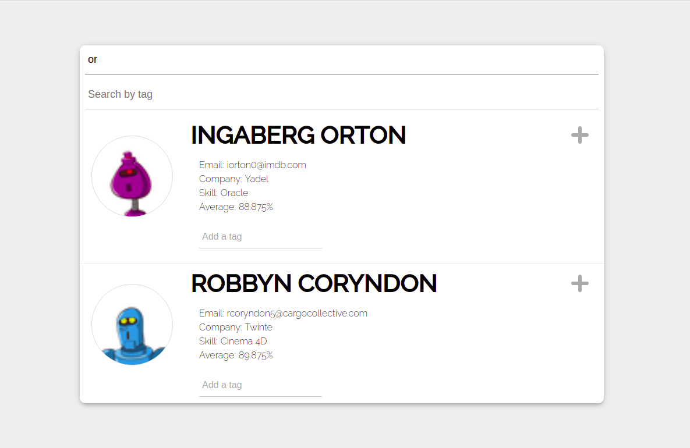

# STUDENTS PROFILES

This project was bootstrapped with [Create React App](https://github.com/facebook/create-react-app).
It is a list of student's profiles that you can filter by name or by tags.

The project includes these features:

- A List of student profiles  
- Add tags to profiles
- Filtering profiles by names and by tag
- Display grades list in an expandable view (accordion)

The app is using [Hatchways API](https://api.hatchways.io/assessment/students) as API.

## Live Demo

Please check [LIVE DEMO](https://student-profiles-ericmbouwe.netlify.app/)

## Getting Started

To get a local copy up and running follow these simple example steps.

### Prerequisites

Make sure Node.js is running on your local machine.

## Setup

- Clone this repository
- Open terminal
- Change directory by using `cd students-profiles`
- Run `npm install`

### Usage

- Run `npm start`
- Open a browser and go to http://localhost:3000

## Test app

- Clone this repository
- Open terminal
- Change directory by using `cd student-profiles`
- Run `npm install`
- Run `npm test` to run all tests

## Note

I started this project 4 days ago and for some reason beyond my control I was not able to work on it the first 3 days after the activation of the evaluation. I actually had a few power issues which luckily have already been fixed.

# Authors

Reach out to me at one of the following places!

👤 **Eric Mbouwe**

- Website: [ericmbouwe.com](https://ericmbouwe.netlify.app)
- LinkedIn: [Eric Mbouwe](https://www.linkedin.com/in/ericmbouwe/)
- Github: [@ericmbouwe](https://github.com/ericmbouwe)
- Twitter: [@ericmbouwe](https://twitter.com/ericmbouwe)
- Mail: [ericmbouwe@gmail.com](ericmbouwe@gmail.com)

## 🤝 Contributing

Contributions, issues and feature requests are welcome!

Feel free to check the [issues page](https://github.com/EricMbouwe/student-profiles/issues).

## Show your support

Give a ⭐️ if you like this project!

## Acknowledgments